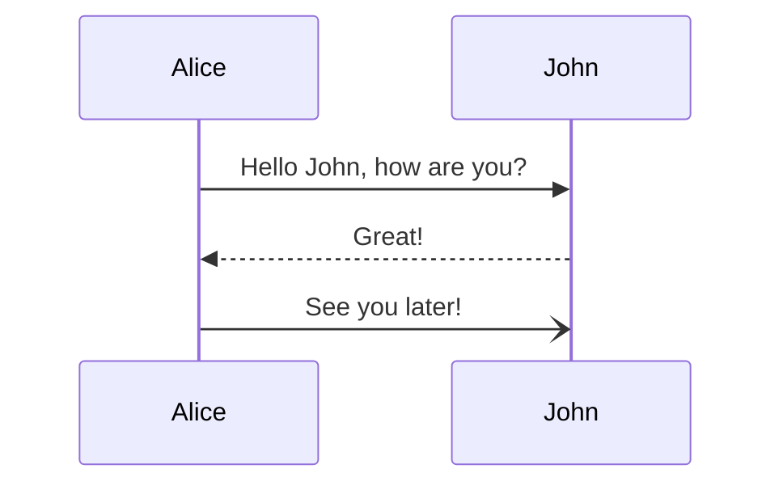

## E-commerce 구축하기
인터뷰를 통해서 이커머스 프로젝트에서 부족했던 점들을 알 수 있었다. 그래서 혼자 이커머스 서버 구축을 목표로 다시 공부를 하려고 한다. 

이 프로젝트를 진행하면서 동시성 문제나 Lock 관련된 문제를 경험하고 RDBMS를 다시 공부해보는 시간을 가지고자 한다. 

이번주 동안은 시퀀스다이어그램, ERD, API 을 작성하고 진행하겠다.

---

## 시퀀스 다이어그램 
시퀀스 다이어그램은 draw.io 만 알고 있었는데 mermaid 를 활용해서 그릴 수 있다는 것을 알아서 익숙해지려 사용하려 한다. 

